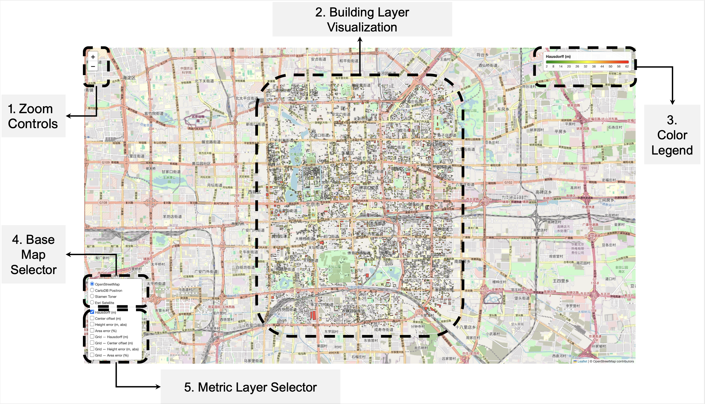
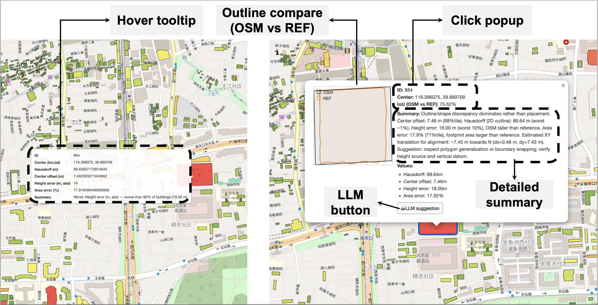
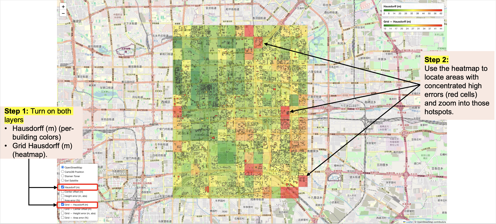
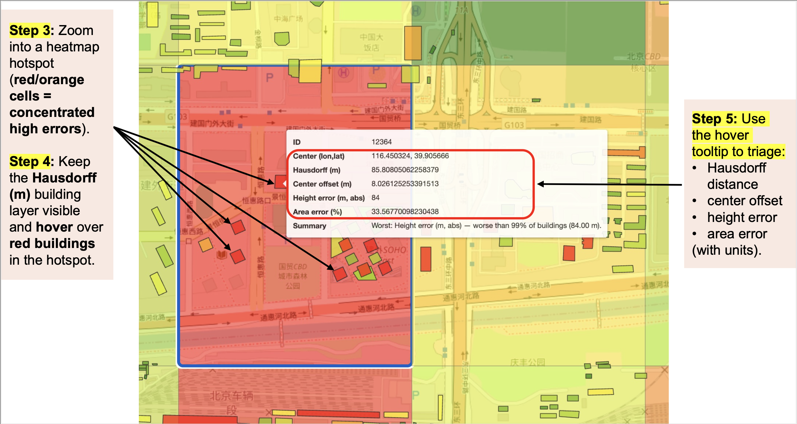
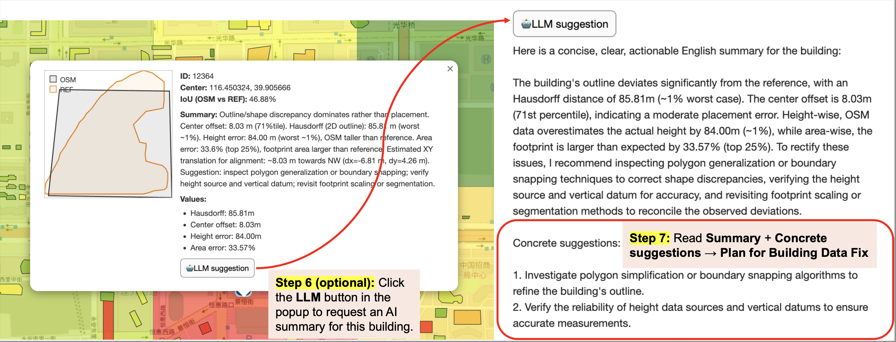

# OSM-3D-Building-Quality-Assessment

Implementation of a framework that combines **comparative metrics** and **machine learning** to evaluate the quality of **OpenStreetMap (OSM) 3D building** data.

> ⚠️ **Note on loading time**  
> The interactive HTML files embed all building geometries, precomputed error metrics, and interactive layers in a single file.  
> When you open them in a browser for the first time, they may take **some time to load**, especially on machines with limited memory.

At this stage, this repository mainly provides the **interactive result visualisations** (three HTML maps for the study areas).  
If you are interested in the **full source code and processing pipeline**, please feel free to contact the author — the code can be shared upon reasonable request.

---

## 1. Repository contents

The directory `results_html/` contains three ZIP archives. After unzipping, you will obtain three standalone HTML files (the core result visualisations):

- `miyun_eval_multi_metrics.html`
- `ningbo_eval_multi_metrics.html`
- `xicheng_eval_multi_metrics.html`

Each HTML file is a **standalone interactive map** and can be opened directly in a modern web browser (e.g., Chrome, Firefox, Edge).

These maps allow you to:

- explore per-building error metrics (e.g., height difference, footprint discrepancy, 3D Hausdorff distance)
- compare OSM buildings against authoritative reference data
- inspect spatial patterns of errors via grid-based heat maps
- obtain per-building diagnostic summaries (via tooltips, popups, and an LLM-based helper)

### ⚠️ Update: High-Precision Dutch Datasets & Lightweighting Strategy

We have added a new directory (e.g., `New_results_html/`) containing updated evaluations, which now include the newly added Dutch regions (such as Almere and Amsterdam). 

Due to the massive number of matched buildings in these high-precision datasets, rendering all building geometries in a single interactive HTML file exceeds typical browser limits and causes loading failures. To ensure smooth performance, we have implemented a **lightweighting strategy** for these new files: the maps now **only render the top 20% worst-performing buildings** (i.e., those with the highest errors).

*Note: Although the individual building polygons are filtered to show only the worst 20% cases, the background Grid Heatmap layers are still calculated using **100% of the dataset** to accurately reflect the global error distribution.*

---

## 2. How to open the interactive maps

1. Download or clone this repository.
2. Go to the `results_html/` folder.
3. Unzip each file:
   - `miyun_eval_multi_metrics.html.zip`
   - `ningbo_eval_multi_metrics.html.zip`
   - `xicheng_eval_multi_metrics.html.zip`
4. Open the extracted `.html` file (e.g., `miyun_eval_multi_metrics.html`) in your browser.

**Tips**
- For best performance, use Chrome/Edge and avoid opening multiple large HTML maps simultaneously.
- If the map appears blank at first, wait a few seconds for layers to finish loading.

---

## 3. Interactive map interface (per-building diagnostics)

This section briefly introduces the main components of the interface and their basic functions.

### 3.1 Interface overview

The interactive map contains five main elements:

1. **Zoom controls (upper left corner):** Two buttons allow users to zoom the map view in or out (adjusting the map scale).
2. **Building layer visualization (center):** Building footprints are color-coded by the selected error metric (**green = smaller error**, **red = larger error**).
3. **Color legend (upper right corner):** A color bar shows the value range for the selected metric (low → high error) and updates automatically when switching metrics.
4. **Base map selector (lower left, top section):** Switch between base maps (e.g., standard OSM map or satellite imagery).
5. **Metric layer selector (lower left, bottom section):** Toggle metric layers. Multiple layers can be active simultaneously (e.g., enable both a grid heat map and a per-building layer).

### 3.2 Tooltip and popup panels

- **Tooltip (hover):** Hover over a building to display its ID and the raw values of all error metrics.
- **Popup (click):** Click a building to open a detailed panel showing:
  - side-by-side outline comparison (**OSM footprint vs. reference data**)
  - IoU value
  - brief error diagnosis  
  The popup also includes an **LLM button** for an automatically generated summary (Chinese or English) of potential issues.

---

## 4. Recommended usage workflow

This section outlines a recommended workflow for using the interface to identify error hotspots and diagnose individual building issues.

### Steps 1–2: locate hotspots

Turn on **both**:
- the **Hausdorff grid heatmap layer**, and
- the **building-level Hausdorff layer**

Red/orange grid cells indicate hotspot regions where errors are concentrated.

### Steps 3–5: drill down by zooming and hovering

Zoom into a hotspot area while keeping the Hausdorff building layer visible. Hover over buildings to quickly review metric values and identify likely causes of large errors.

### Steps 6–7: validate issues with detailed popups (optional LLM summary)

If the hover tooltip does not fully explain the issue, click a building to open its detailed popup. Use it to:
- inspect the outline comparison (OSM vs. reference)
- confirm the IoU value
- read the concise diagnosis

Optionally, click the **LLM button** to obtain automatically generated suggestions for how to address the identified issues.

---

## Contact

If you would like access to the full processing pipeline and source code, please contact the author (code can be shared upon reasonable request).
